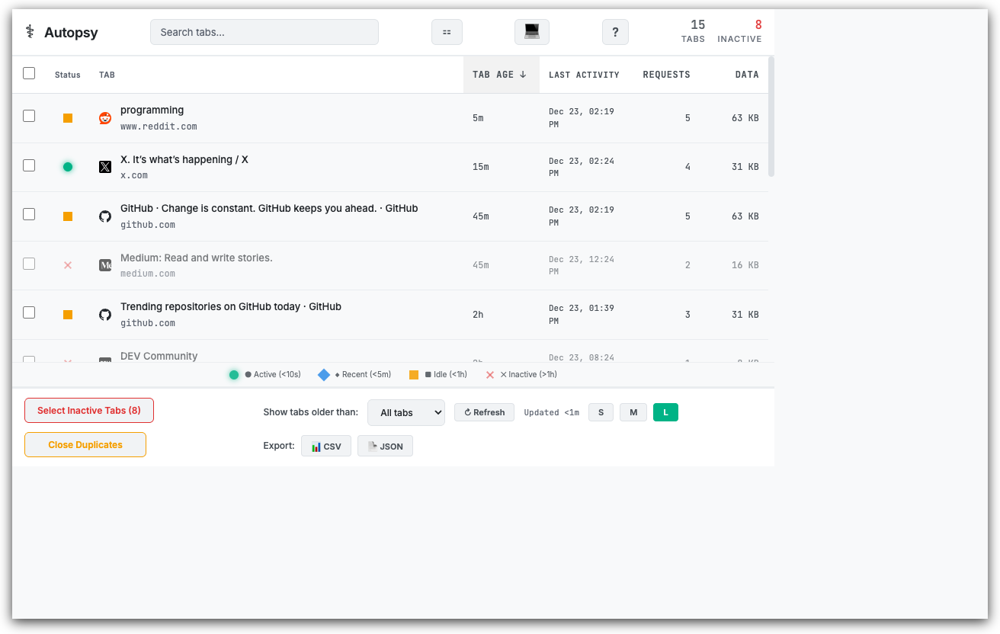
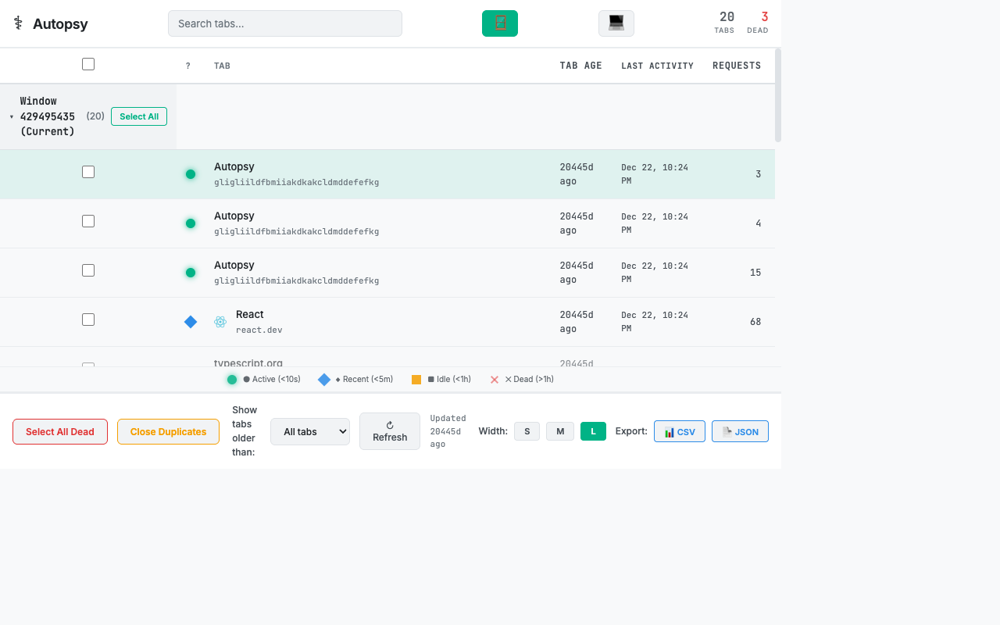
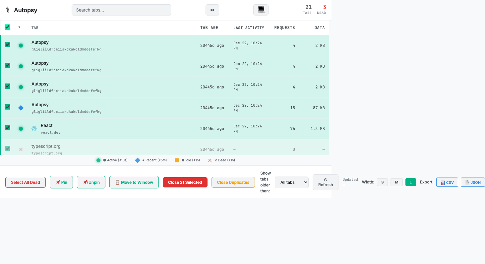
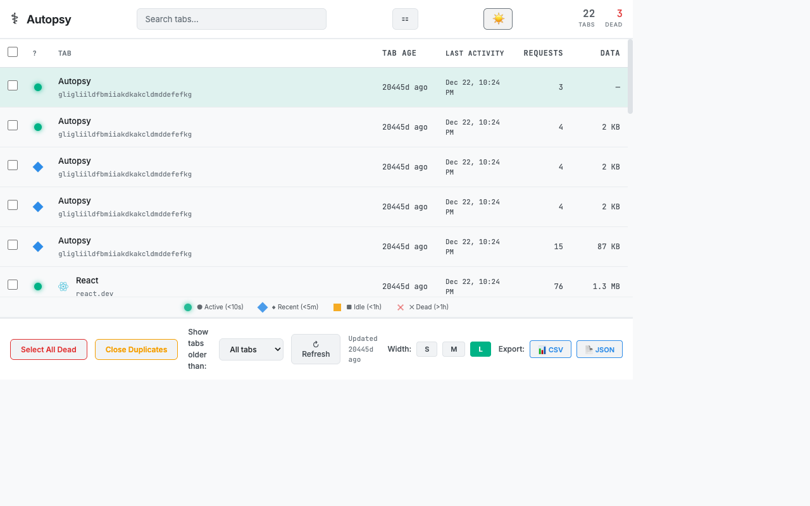

# Autopsy

[](https://github.com/scttfrdmn/autopsy/releases)
[](LICENSE)
[](https://www.typescriptlang.org/)
[](eslint.config.js)
[](https://prettier.io/)

> **Postmortem analysis for your tabs** — Find what to close

A lightweight Chrome extension that helps you identify which tabs to close through real-time activity tracking, smart status indicators, and comprehensive tab analysis.

---

## 🔍 Smart Analysis

**Real-time network activity tracking**
Monitor requests, bytes transferred, and timing for each tab

**Intelligent status indicators**
- **●** Active — Network activity in last 10 seconds
- **◆** Recent — Active in last 5 minutes
- **■** Idle — Active in last hour
- **✕** Dead — No activity for over an hour

**Per-instance age tracking**
Accurate tab ages that persist across browser restarts

**Memory usage insights**
Identify resource-heavy tabs and processes

---

## 🎯 Bulk Operations

- **Close duplicates** — Remove duplicate URLs, automatically keeps newest
- **Bulk pin/unpin** — Manage multiple tabs at once
- **Select by domain** — Quick domain-wide selection with one click
- **Move to new window** — Organize selected tabs across windows

---

## 📊 Advanced Grouping

- **Group by domain** — Organize tabs by website
- **Group by window** — See tabs per browser window
- **Group by status** — View by activity level (active, recent, idle, dead)
- **Collapsible groups** — Clean, organized view

---

## 📁 Data Export

- **CSV export** — Export to spreadsheet for analysis
- **JSON export** — Programmatic processing and backup
- **Full metrics included** — Age, status, network stats, groups

---

## 🎨 Customization

- **Dark/Light themes** — Respects system preference or manual override
- **Responsive width** — Small (600px), Medium (800px), Large (1000px)
- **Accessible design** — WCAG AA compliant with shape variants

---

## ⚡ Lightweight Design

- Built with **Preact** (3KB vs React's 40KB)
- Efficient background service worker
- Total extension size: **<50KB**
- **Minimal resource footprint** — doesn't contribute to the problem!

---

## 📸 Screenshots

<details>
<summary>Click to view screenshots</summary>

### Main Interface


### Domain Grouping


### Status Grouping


### Bulk Operations


### Light Theme


</details>

---

## 🚀 Installation

### Chrome Web Store
*Coming soon! Currently under review.*

### Development Mode

1. **Clone the repository:**
   ```bash
   git clone https://github.com/scttfrdmn/autopsy.git
   cd autopsy
   ```

2. **Install dependencies:**
   ```bash
   npm install
   ```

3. **Build the extension:**
   ```bash
   npm run build
   ```

4. **Load in Chrome:**
   - Open Chrome and navigate to `chrome://extensions/`
   - Enable "Developer mode" (toggle in top right)
   - Click "Load unpacked"
   - Select the `dist` folder from this project

### Development with Hot Reload

```bash
npm run dev
```

Then load the `dist` folder as an unpacked extension. Vite will rebuild on changes.

---

## 💻 Usage

1. Click the **Autopsy** icon in your Chrome toolbar
2. View your tabs with real-time status indicators
3. Click **column headers** to sort (Age, Status, Memory, etc.)
4. Click a **row** to focus that tab
5. Click the **×** button to close a tab
6. Use **bulk operations** to manage multiple tabs at once
7. **Group tabs** by domain, window, or status
8. **Export data** to CSV or JSON for analysis

---

## 🏗️ Architecture

### Background Service Worker (`src/background/worker.ts`)
- Tracks tab creation times with per-instance fingerprinting
- Monitors network requests (count, timing, bytes)
- Lightweight in-memory storage
- Automatic cleanup when tabs close

### Popup UI (`src/popup.tsx`)
- Preact-based interface (minimal bundle size)
- Aggregates data from Chrome APIs and background worker
- Smart sorting and filtering
- Professional, accessible design

### Type Safety
Full TypeScript support with strict mode and Chrome extension types.

---

## 🔒 Privacy & Security

**All data stays local on your device.**

- ✅ No cloud sync
- ✅ No tracking or telemetry
- ✅ No external servers
- ✅ Open source and auditable

**Data stored locally:**
- Tab creation timestamps
- Per-instance tab metadata
- User preferences (theme, width)
- Network activity statistics (in memory)

**See our [Privacy Policy](PRIVACY.md) for details.**

---

## 🛠️ Development

### Tech Stack
- **TypeScript 5.3** — Type-safe development
- **Preact** — Lightweight React alternative
- **Vite** — Fast build tooling
- **Chrome Extension Manifest V3** — Modern extension platform
- **ESLint + Prettier** — Code quality and formatting

### Scripts

```bash
npm run dev       # Development mode with hot reload
npm run build     # Production build
npm run lint      # Run ESLint
npm run lint:fix  # Fix ESLint issues
npm run format    # Format code with Prettier
```

### Project Structure

```
autopsy/
├── src/
│   ├── background/
│   │   └── worker.ts          # Service worker
│   ├── popup.tsx              # Main UI component
│   ├── popup.css              # Styles
│   └── types/
│       └── index.ts           # TypeScript definitions
├── public/
│   ├── manifest.json          # Extension manifest
│   └── icon*.png              # Extension icons
├── dist/                      # Build output
└── package.json
```

---

## 🤝 Contributing

Contributions are welcome! Please feel free to submit a Pull Request.

1. Fork the repository
2. Create your feature branch (`git checkout -b feature/amazing-feature`)
3. Commit your changes (`git commit -m 'Add some amazing feature'`)
4. Push to the branch (`git push origin feature/amazing-feature`)
5. Open a Pull Request

---

## 📄 License

This project is licensed under the MIT License - see the [LICENSE](LICENSE) file for details.

---

## 📧 Contact

**Support:** autopsy.tabs@gmail.com
**Issues:** [GitHub Issues](https://github.com/scttfrdmn/autopsy/issues)
**Source:** [GitHub Repository](https://github.com/scttfrdmn/autopsy)

---

## 🙏 Acknowledgments

- Built with [Preact](https://preactjs.com/)
- Bundled with [Vite](https://vitejs.dev/)
- Icons designed with surgical/medical inspection theme
- Inspired by the need for better tab management

---

**Don't let tab hoarding slow you down. Perform the autopsy.** 🔬
